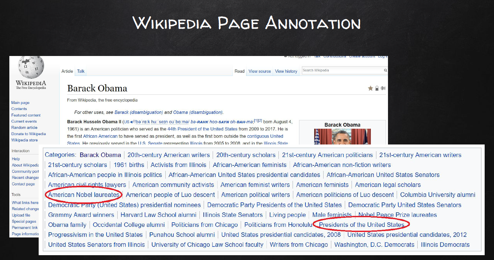

# Wiki-Text-Categorization

Designing a model to tag Wikipedia documents with relevant subset of categories from a set of millions of categories (Multi-Instance Multi-Label, popularly known as MIML problem)    

Example Wikiepdia Page of Barack Obama along with it's categories.  
